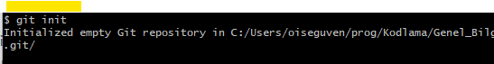

### Git Nedir?
- GIT nedir? Bir versiyon kontrol sistemidir. Yani  Bir döküman üzerinde yaptığınız degişiklikleri adım adım izleyen, istediğinizde kayıt eden ve isterseniz bunu internet üzerindeki bir bilgisayarda veya yerel bir cihazda (respository / repo / depo) saklamanızı ve yönetmenizi sağlayan bir sistemdir. 
- Linux'un mimarı Linus Torvalds dan yazılmış. 2005
---
 ### Git Niçin Kullanılır ?
- Bilgisayarınızda ve internette (Github gibi) dosyalarınızı ve versiyon kontrol bilgilerinizi depolayabilirsiniz.
- "commit" yaparak SnapShot (anlık görüntü) ile dosyaların o anki halini kayıt altına alabilirsiniz. Böylelikle ileride bir hata ile karşılaşırsanız herhangi bir zamandaki herhangi bir versiyona dönüş yapabilirsiniz.

- Kişilerin aynı projede çalışmasını sağlar. Proje üstünde Yapılan değişiklikleri görebilirsiniz.
- Projede versiyonlanmasını istemediğiniz dosyaları belirtebilirsiniz. (key,log .. gibi)
---
### Git Komutları
 Komutlara başlamadan önce bilmemiz gereken terimler.
  

- **untracked (izlenmeyen)**: Yeni oluşturulmuş dosyaları ifade eder. **git init** komutu çalıştırılmış ama dosyada hiç bir işlem yapılmamıştır.
- **unstaged (hazırlanmamış)**: Dosyada değişiklik yapılmıştır.Ancak **commit add** komutu çalıştırılmamış commit’lenmek için hazırlanmamış dosyaları ifade eder.
- **staged (hazırlanmış)**: Commit’lenmeye hazır olan dosyaları ifade eder.
deleted (silinmiş): Projeden silinmiş ama GIT üzerinden kaldırılmamış dosyaları ifade eder.
- ***Git İşleyiş şeması***

 

 1- **git init** 
-versiyon kontol işlemi yapmak istediğimiz *Klasörde* bu komutu çalıştırırız.

 
 
 "Genel_Bilgi" klasörü için git versiyon işlemi başlamıştır.

  2- **git config**

*git*  ile ilgili konfigirasyon ayarları yapmayı sağlar.
- " *git config --list --show-origin* " komutu  Tüm ayarlarınızı ve onların nereden geldiğini görmek için şu komutu kullanabilirsiniz.
- Git’i ilk kurduğunuzda yapmanız gereken ilk şey, kullanıcı adınızı ve e-postanızı belirlemek olmalıdır. Bunu yapmak önemlidir çünkü her Git katkısı (commit) bu bilgileri kullanır ve tüm işlediğiniz katkılara değişmez bir şekilde gömülmüştür.

- " *git config --global user.name* " komutu  tanımlı olan kullanıcı ismini verir.
- " *git config --global email.name* " komutu  tanımlı olan email ismini verir.

user ve email ayarlamak için:

- " *git config --global user.name "user_name"* "
- " *git config --global email.name "email_adresi"* " komutları kullanılır.

3- **git add** 

  -  Değişiklik yapılan dosyaları staged ortamına göndermek için kullanılır.
 
  - git add <dosya_ismi> sadece belirtilen dosyayı stage gönderir.
 
* | `git add .`  | Yeni ve değişen dosyaları ekler, **silinen dosyaları eklemez**      |
* | `git add -A` | Yeni, değişmiş **ve silinmiş** tüm dosyaları ekler                  |
* | `git add -u` | Sadece değişmiş ve silinmiş dosyaları ekler, yeni dosyaları eklemez |

4- **git rm**
  - git rm komutu, Git deposundaki bir dosyayı silmek ve bu silme işlemini commit'e hazırlamak için kullanılır.Yani hem çalışma klasöründen dosyayı siler, hem de staging area'ya "bu dosya silindi" bilgisini ekler.
  - git rm app.js : Belirli bir dosyayı silmek 'app.js' dosyasını siler.
  - git rm -r src/ : Bir klasörü ve içindekileri silmek
  - git rm --cached dosya.json : Dosyayı Git’ten sil ama bilgisayardan silme. Bu işlem dosyayı bilgisayarda bırakır ama Git’ten çıkarır.Genelde .env, config.json gibi dosyalar için kullanılır.
  
  5- **git status**
  - git staus : Yapılan değişiklikler, eklenen ve silinen dosyalar gibi bilgiler listelenir.